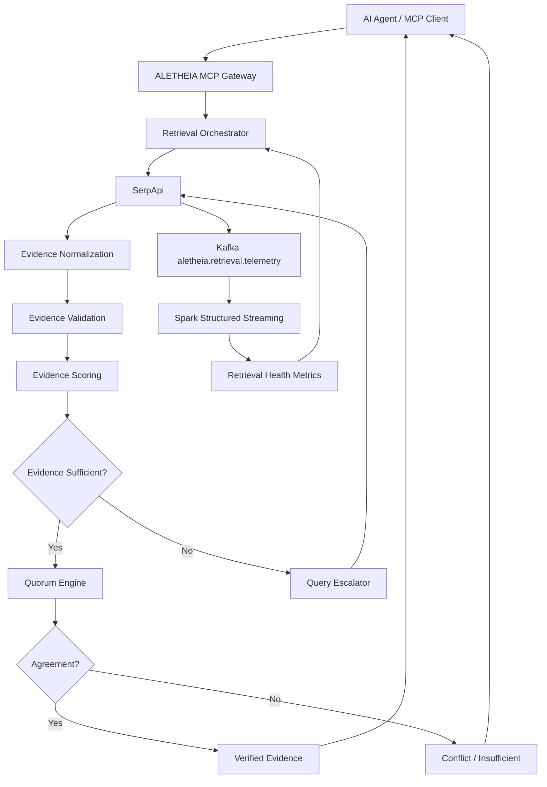

# ALETHEIA — Evidence Integrity & Recovery Layer for SerpApi-Powered AI Agents

[](https://opensource.org/licenses/MIT)
[](https://modelcontextprotocol.io/)
[](https://serpapi.com/)
[](https://github.com/Sivasakthi-Vengatesan/aletheia-dashboard)

> **"Search results are not evidence until they survive validation."**


ALETHEIA is an open-source MCP-compatible evidence reliability gateway that sits between AI agents and SerpApi. It evaluates the quality, sufficiency, freshness, and consistency of retrieved search evidence, autonomously escalates weak queries, cross-validates claims across independent domains, tracks retrieval health through Kafka + Spark Structured Streaming, and returns only evidence satisfying configurable reliability policies.

---

## 🏛️ Architecture



---

## 🖥️ Production Retro 1-Bit OS Dashboard

ALETHEIA features a dedicated workstation console built with an authentic **1-Bit Monochrome OS aesthetic** (16px CRT monitor bezel, mathematical 4x4 dither matrix textures, 6-stripe 1px titlebars, and procedural Web Audio waveform synthesized feedback).

### 8 Operational Panes:
1. **OVERVIEW**: System KPIs (`[VERIFIED]`, verification rate, average scores, active circuits, recent retrievals table).
2. **SEARCH**: Real-time retrieval console with step-by-step terminal log pipeline (`[01]` to `[13]`) and autonomous escalation progression visualizer.
3. **EVIDENCE**: 7-component transparent score decomposition (Structure, Diversity, Relevance, Freshness, Agreement, URL Quality), validation quality gates, and normalized evidence corpus.
4. **LINEAGE**: Cryptographic DAG tracing provenance from natural language query through SerpApi, normalization, and scoring with SHA-256 lineage hashes.
5. **ENGINES**: Real-time SerpApi engine monitor (`google`, `google_news`, `google_scholar`, fallback) with observed latency and error rates.
6. **TELEMETRY**: Kafka + Spark Structured Streaming monitoring layer with 1-bit pixel histograms for latency (P50/P95) and rolling evidence quality.
7. **CIRCUITS**: Data-quality circuit breaker states (`[CLOSED]`, `[HALF-OPEN]`, `[OPEN]`) protecting agent retrieval paths from degraded payloads.
8. **SETTINGS**: Configurable reliability policy editor (min score, min sources, min domains, escalation toggle) and retro display/synthesizer preferences.

---

## 🚀 Quick Start

### Running the Dashboard Locally

```bash
# Clone the repository
git clone https://github.com/Sivasakthi-Vengatesan/aletheia-dashboard.git
cd aletheia-dashboard

# Option 1: Python built-in HTTP server
python -m http.server 8080

# Option 2: Node npx serve
npx serve -l 8080 .
```

Open `http://localhost:8080` in any modern web browser to access the 1-bit operational console.

---

## 🤖 MCP (Model Context Protocol) Integration

ALETHEIA exposes an MCP-compliant endpoint that allows AI agents in Claude Desktop, Cursor, and custom agentic frameworks to consume verified search evidence with cryptographic lineage.

### MCP Configuration (`claude_desktop_config.json` / `cursor.json`)

```json
{
  "mcpServers": {
    "aletheia-evidence-gateway": {
      "command": "python",
      "args": ["-m", "aletheia.mcp_server", "--port", "8000"],
      "env": {
        "SERPAPI_API_KEY": "${SERPAPI_API_KEY}",
        "ALETHEIA_MIN_SCORE": "0.75",
        "ALETHEIA_MIN_DOMAINS": "3",
        "ALETHEIA_QUORUM_RATIO": "0.66",
        "KAFKA_BOOTSTRAP_SERVERS": "localhost:9092"
      }
    }
  }
}
```

### Supported MCP Tools

| Tool Name | Parameters | Description |
|---|---|---|
| `aletheia_retrieve_verified` | `query` (str), `max_results` (int), `recency_days` (int) | Autonomous search with multi-engine escalation, 7-factor scoring, quorum cross-validation, and returns structured verified claims. |
| `aletheia_validate_corpus` | `claims` (array), `sources` (array) | Runs raw external evidence through ALETHEIA's validation quality gates (relevance, structure, temporal freshness, agreement). |
| `aletheia_get_lineage` | `retrieval_id` (str) | Returns the cryptographic SHA-256 DAG provenance chain for any past retrieval. |
| `aletheia_circuit_status` | `engine` (optional str) | Returns circuit breaker states (`CLOSED`, `HALF-OPEN`, `OPEN`), error rates, and failure quotas. |

---

## 📊 Telemetry & Data Stream Specifications

ALETHEIA streams telemetry events to Kafka topic `aletheia.retrieval.telemetry` consumed by Apache Spark Structured Streaming:

### Kafka Telemetry Event Schema

```json
{
  "event_id": "evt_7f8c9b201a4e",
  "timestamp": "2026-09-29T22:30:00Z",
  "retrieval_id": "ret_a91b4e2f8c03",
  "query": "Quantum supremacy benchmark 2026",
  "engine_used": "google_scholar",
  "escalated": true,
  "escalation_strategy": "expand_keywords_and_engines",
  "latency_ms": 312,
  "evidence_count": 8,
  "unique_domains": 5,
  "scores": {
    "structure": 0.94,
    "diversity": 0.88,
    "relevance": 0.92,
    "freshness": 0.85,
    "agreement": 0.90,
    "url_quality": 0.95,
    "composite": 0.91
  },
  "circuit_state": "CLOSED",
  "verification_status": "VERIFIED"
}
```

---

## ⌨️ Keyboard Shortcuts

| Key / Combination | Action |
|---|---|
| `1` - `8` | Direct switch between the 8 Operational Panes (Overview, Search, Evidence, Lineage, Engines, Telemetry, Circuits, Settings) |
| `Ctrl / Cmd + N` | Focus New Retrieval Query input |
| `Ctrl / Cmd + E` | Export Verified Evidence corpus to JSON |
| `Ctrl / Cmd + L` | Inspect cryptographic Lineage DAG |
| `Ctrl / Cmd + S` | Commit updated Reliability Policies |
| `Space` | Toggle Audio Feedback / Mute |
| `Escape` | Close active dialog or dropdown menu |

---

## 📜 License

MIT License. Built for the SerpApi Hackathon & Open Source Developer Infrastructure.

