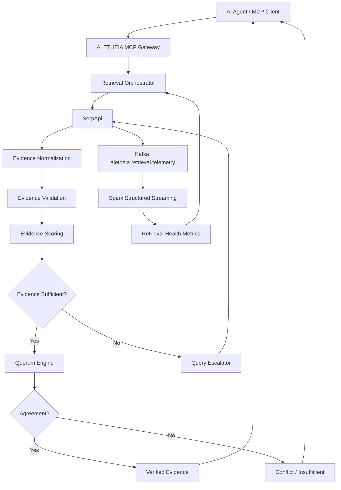

# ALETHEIA — Evidence Integrity & Recovery Layer for SerpApi-Powered AI Agents

> **"Search results are not evidence until they survive validation."**

ALETHEIA is an open-source MCP-compatible evidence reliability gateway that sits between AI agents and SerpApi. It evaluates the quality, sufficiency, freshness, and consistency of retrieved search evidence, autonomously escalates weak queries, cross-validates claims across independent domains, tracks retrieval health through Kafka + Spark Structured Streaming, and returns only evidence satisfying configurable reliability policies.

---

## 🏛️ Architecture



---

## 🖥️ Production Retro 1-Bit OS Dashboard

ALETHEIA features a dedicated workstation console built with an authentic **1-Bit Monochrome OS aesthetic** (16px CRT monitor bezel, mathematical 4x4 dither matrix textures, 6-stripe 1px titlebars, and procedural Web Audio waveform synthesized feedback).

### 8 Operational Panes:
1. **OVERVIEW**: System KPIs (`[VERIFIED]`, verification rate, average scores, active circuits, recent retrievals table).
2. **SEARCH**: Real-time retrieval console with step-by-step terminal log pipeline (`[01]` to `[13]`) and autonomous escalation progression visualizer.
3. **EVIDENCE**: 7-component transparent score decomposition (Structure, Diversity, Relevance, Freshness, Agreement, URL Quality), validation quality gates, and normalized evidence corpus.
4. **LINEAGE**: Cryptographic DAG tracing provenance from natural language query through SerpApi, normalization, and scoring with SHA-256 lineage hashes.
5. **ENGINES**: Real-time SerpApi engine monitor (`google`, `google_news`, `google_scholar`, fallback) with observed latency and error rates.
6. **TELEMETRY**: Kafka + Spark Structured Streaming monitoring layer with 1-bit pixel histograms for latency (P50/P95) and rolling evidence quality.
7. **CIRCUITS**: Data-quality circuit breaker states (`[CLOSED]`, `[HALF-OPEN]`, `[OPEN]`) protecting agent retrieval paths from degraded payloads.
8. **SETTINGS**: Configurable reliability policy editor (min score, min sources, min domains, escalation toggle) and retro display/synthesizer preferences.

---

## 🚀 Quick Start

### Running the Dashboard Locally
```bash
# Clone the repository
git clone https://github.com/Sivasakthi-Vengatesan/aletheia-dashboard.git
cd aletheia-dashboard

# Start local server
python -m http.server 8080
# Open http://localhost:8080 in your browser
```

---

## 📜 License
MIT License. Built for the SerpApi Hackathon & Open Source Developer Infrastructure.
